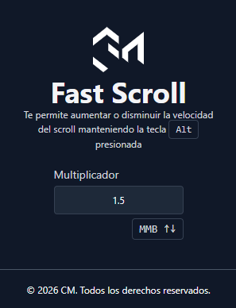

# Fast Scroll



**Fast Scroll** es una extensión de Chrome que te permite aumentar o disminuir la velocidad del scroll manteniendo presionada la tecla `Alt`. Ideal para navegar rápidamente por páginas largas o documentos extensos.

## 🚀 Características

- **Control de velocidad**: Aumenta la velocidad del scroll simplemente manteniendo presionada la tecla `Alt`.
- **Integración nativa**: Funciona en cualquier página web.
- **Ligera y rápida**: Construida con tecnologías modernas para un rendimiento óptimo.

## 🛠️ Tecnologías

Este proyecto está construido con:

- [React](https://react.dev/)
- [TypeScript](https://www.typescriptlang.org/)
- [Vite](https://vitejs.dev/)
- [TailwindCSS](https://tailwindcss.com/)
- [Bun](https://bun.sh/) (Runtime & Package Manager)

## 📥 Instalación y Configuración

Para ejecutar este proyecto localmente o construir la extensión, sigue estos pasos:

### 1. Clonar el repositorio

```bash
git clone <url-del-repositorio>
cd fast-scroll-chrome-extension
```

### 2. Instalar dependencias

Asegúrate de tener [Bun](https://bun.sh/) instalado.

```bash
bun install
```

### 3. Construir la extensión

Ejecuta el comando de setup que se encarga de construir tanto la aplicación de React como los content scripts y mover los archivos necesarios a la carpeta final `extension/`.

```bash
bun run setup:extension
```

Este comando realizará las siguientes tareas:
- Construirá la aplicación Vite.
- Limpiará la carpeta `extension/`.
- Compilará los scripts de contenido (`content.js`).
- Copiará los iconos y el manifiesto.

### 4. Cargar en Google Chrome

1. Abre Chrome y ve a `chrome://extensions/`.
2. Activa el **Modo de desarrollador** (Developer mode) en la esquina superior derecha.
3. Haz clic en el botón **Cargar descomprimida** (Load unpacked).
4. Selecciona la carpeta `extension/` que se generó en la raíz de tu proyecto.

¡Listo! La extensión debería estar activa y funcionando.

## 🤝 Contribuir

¡Las contribuciones son bienvenidas! Si deseas mejorar Fast Scroll, por favor sigue estos pasos:

1. Haz un Fork del proyecto.
2. Crea una nueva rama (`git checkout -b feature/nueva-caracteristica`).
3. Realiza tus cambios y haz commit (`git commit -m 'Agrega nueva característica'`).
4. Haz push a la rama (`git push origin feature/nueva-caracteristica`).
5. Abre un Pull Request.

---

Desarrollado con ❤️ usando React y Vite.
